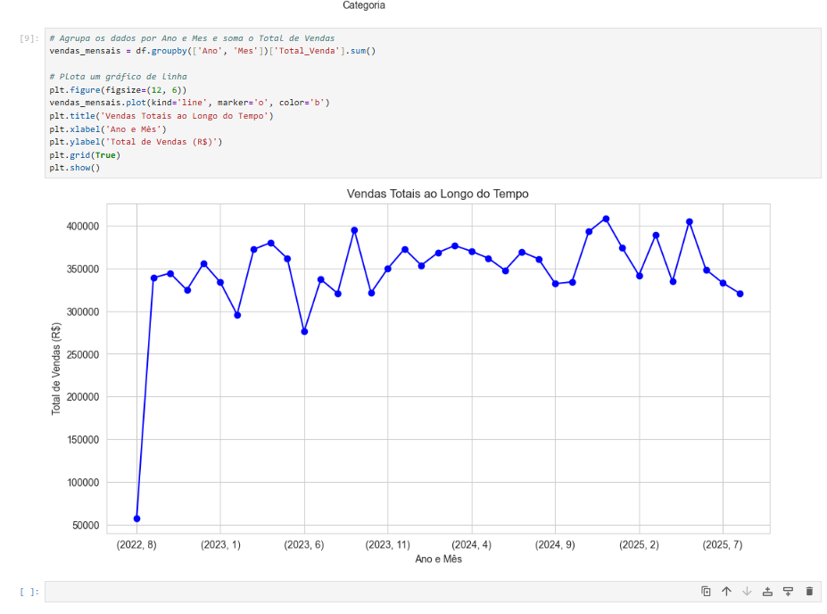

# Análise de Desempenho de Vendas - Business Intelligence

### Sobre o Projeto

Este projeto demonstra um fluxo de trabalho completo de **Análise de Dados e Business Intelligence (BI)**, do início ao fim. O objetivo principal foi analisar um conjunto de dados de vendas de uma loja de varejo para extrair **insights de negócio** e identificar padrões que ajudem na tomada de decisões estratégicas.

As principais etapas do projeto incluíram:
- **Pré-processamento e Limpeza de Dados:** Organização e tratamento das informações para garantir a qualidade da análise.
- **Análise Exploratória de Dados (EDA):** Identificação de tendências, sazonalidades e principais fatores de desempenho através de visualizações.
- **Extração de Insights:** Geração de conclusões e recomendações práticas para o negócio.

### Tecnologias Utilizadas

- **Python**: Linguagem de programação principal.
- **Pandas**: Para manipulação e análise de dados.
- **Matplotlib e Seaborn**: Para a criação de visualizações e gráficos.
- **Jupyter Notebook**: Ambiente interativo para o desenvolvimento da análise.

---

### Principais Insights e Análises

As análises geraram conclusões valiosas sobre o desempenho da empresa:

1.  **Vendas por Categoria:**
    O gráfico abaixo revela o desempenho de cada categoria de produto. Embora as vendas das categorias 'Decoração', 'Ferramentas', 'Alimentos' e 'Eletrônicos' sejam semelhantes, a categoria **Roupas** apresentou o menor desempenho em termos de receita total.

    

2.  **Sazonalidade das Vendas:**
    O gráfico de vendas mensais demonstra um claro padrão de sazonalidade, com picos de vendas significativos no final de cada ano. O maior pico ocorreu em **novembro de 2024**, sugerindo que as vendas de final de ano (como Black Friday e Natal) são um fator crucial para a empresa. Além disso, as vendas gerais parecem ter uma tendência de crescimento anual.

    

---

### Como Rodar o Projeto

Para replicar este projeto, siga os seguintes passos:
1.  Clone o repositório: `git clone https://github.com/Cor4l92/analise-desempenho-vendas-bi.git`
2.  Instale as bibliotecas necessárias: `pip install pandas matplotlib seaborn notebook`
3.  Execute o Jupyter Notebook na pasta do projeto: `jupyter notebook --browser=edge`
