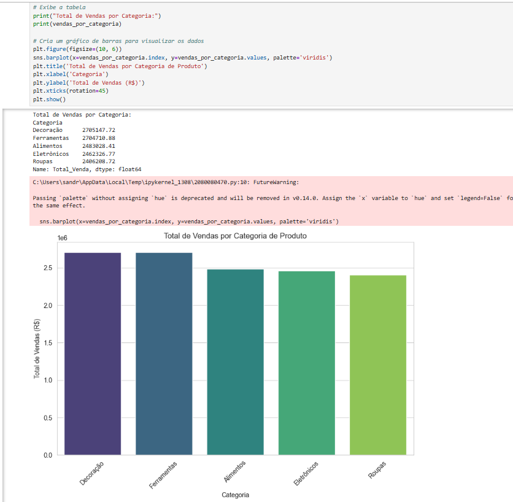
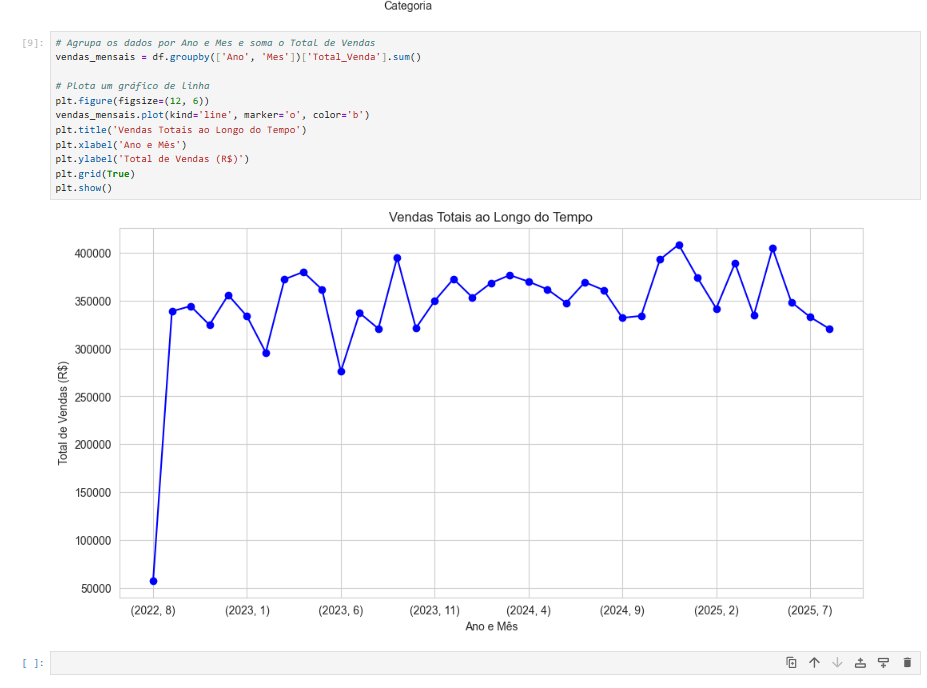
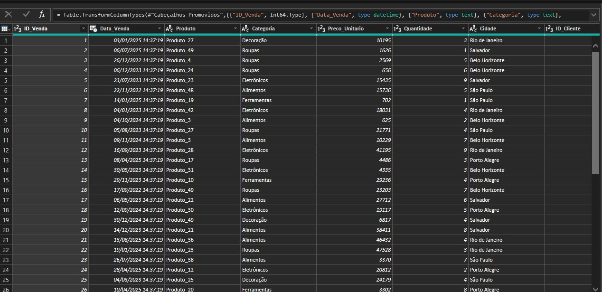
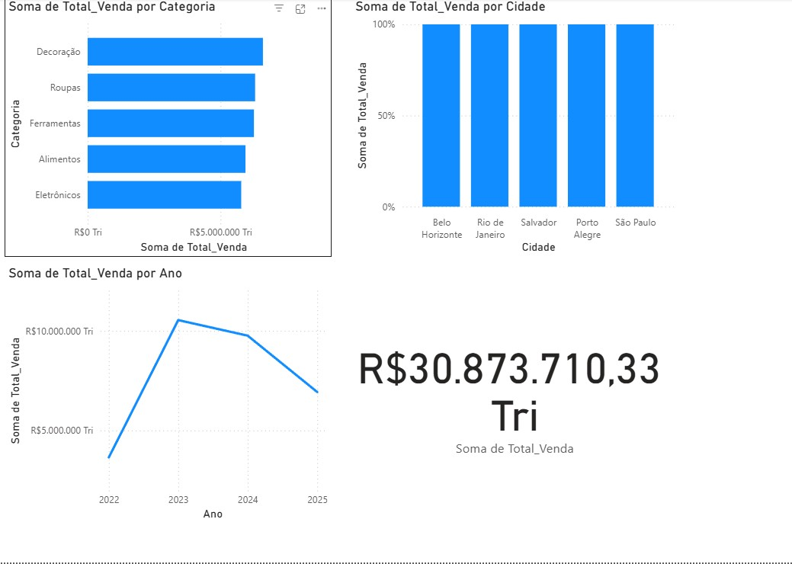
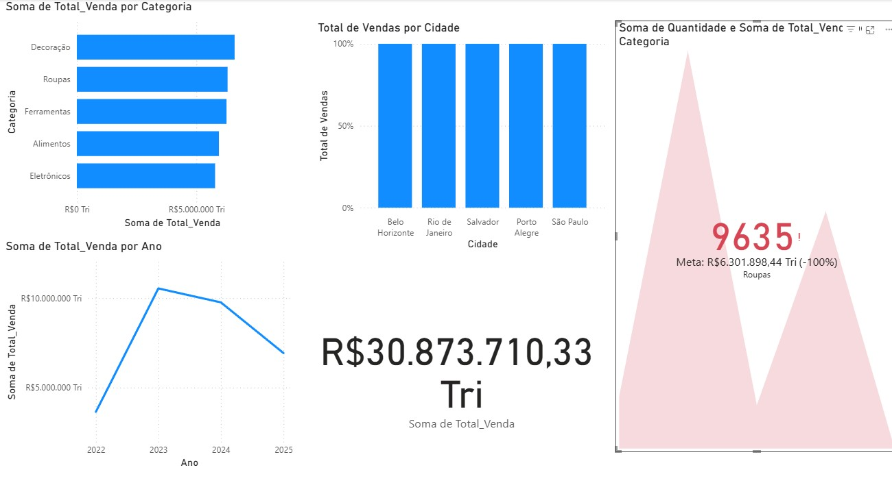

# Análise de Desempenho de Vendas - Projeto Completo de BI

### Sobre o Projeto
Este projeto demonstra um fluxo de trabalho de ponta a ponta em **Análise de Dados** e **Business Intelligence (BI)**. O objetivo foi explorar e extrair insights de um conjunto de dados de vendas de uma loja de varejo, usando **Python** para a análise profunda e **Power BI** para a criação de um dashboard interativo para tomada de decisões estratégicas.

### Tecnologias Utilizadas
-   **Python**: Linguagem de programação para manipulação e análise de dados.
-   **Pandas**: Biblioteca para limpeza e transformação dos dados.
-   **Matplotlib** e **Seaborn**: Para a criação de visualizações exploratórias.
-   **Power BI**: Ferramenta de Business Intelligence para a construção do dashboard final.
-   **Git** e **GitHub**: Para controle de versão e hospedagem do projeto.

---

### O Processo de Análise e os Primeiros Insights

O primeiro passo foi a análise exploratória dos dados usando **Python** e o **Jupyter Notebook**. Esta etapa foi crucial para identificar tendências, padrões e anomalias antes de construir o dashboard.

* **Vendas por Categoria**: Este gráfico revelou o desempenho de vendas de cada categoria de produto, mostrando que a categoria "Roupas" teve a menor receita total.
    

* **Sazonalidade das Vendas**: A análise temporal demonstrou um padrão de vendas cíclico, com picos significativos no final de cada ano, especialmente em novembro e dezembro, o que sugere a influência de feriados e eventos como a Black Friday.
    

---
### O Produto Final: Dashboard de BI no Power BI

Com os dados limpos e os insights iniciais extraídos, a etapa final foi criar um dashboard interativo no **Power BI**. Este dashboard serve como uma ferramenta de BI para que qualquer pessoa de negócio possa monitorar o desempenho das vendas.

#### Componentes do Dashboard

* **Visão Geral de Vendas**: Um cartão de métricas mostra o total de vendas.
* **Distribuição de Vendas**: Gráficos de barras detalham o desempenho de vendas por categoria e cidade.
* **Análise Temporal**: Um gráfico de linha exibe a tendência de vendas ao longo do tempo.

---

### Como Rodar o Projeto
Para replicar este projeto, siga estes passos:
1.  Clone o repositório: `git clone https://github.com/Cor4l92/analise-desempenho-vendas-bi.git`
2.  Instale as bibliotecas Python: `pip install pandas matplotlib seaborn notebook`
3.  Execute o Jupyter Notebook na pasta `notebook/`: `jupyter notebook --browser=edge`
4.  Abra o arquivo `.pbix` na pasta `dashboard/` com o Power BI Desktop.
